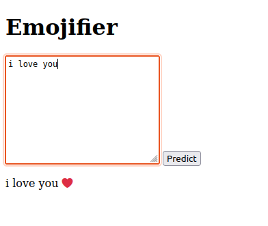
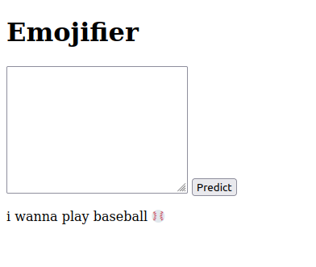

This a mini project using Djano to detect an emotion based on an input text.
You can see here in the images some examples.
To get the glove6b50d file, visit this link: https://www.kaggle.com/datasets/adityajn105/glove6b50d

  
